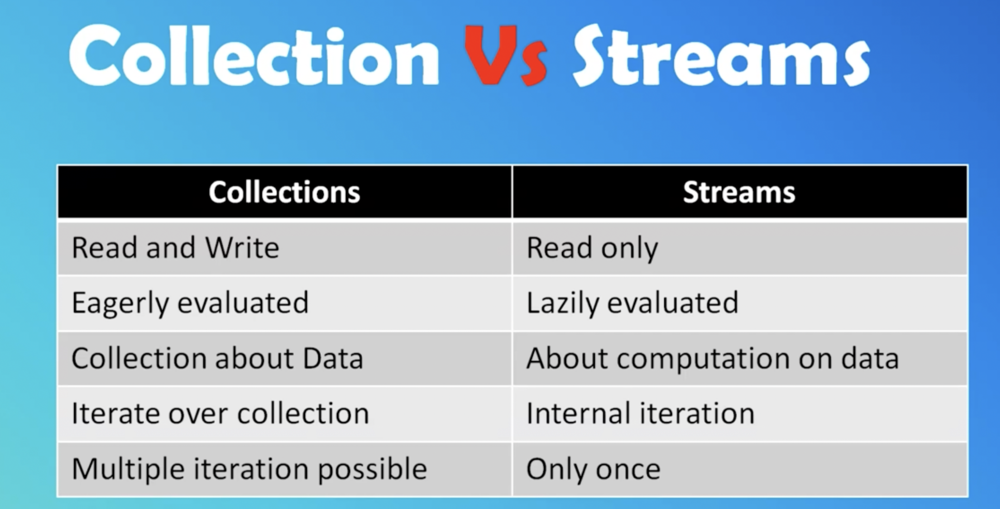
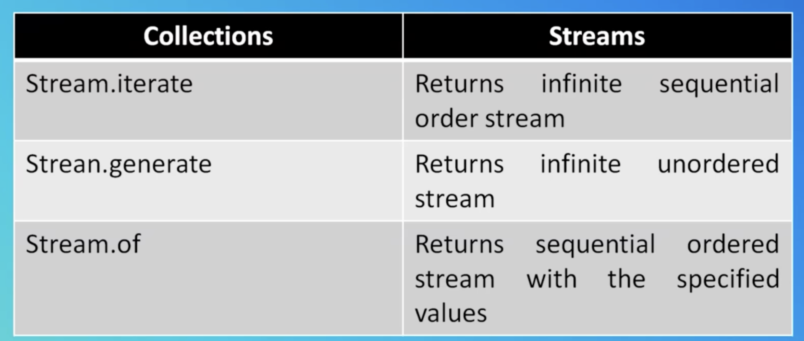

## Stream
1. Sequence of data elements
2. Can be performed either sequentially or parallel.
3. Lazy access supported
4. Designed for lambdas

## Stream API
1. A Stream in Java can be defined as a sequence of elements from a source that supports aggregate operations on them. 
2. Collections or Arrays who provide data to a Stream.
3. Streams don't change the original data structure, they only provide the result as per the pipelined methods.
4. Each intermediate operation is lazily executed and returns a stream as a result.

## Collection vs Stream

### map
1. Transform one type to another type
2. It's not the map collection.

### flatMap
1. Transform one type to another type
2. Used to flatten a stream of collections

## Factory Method's
